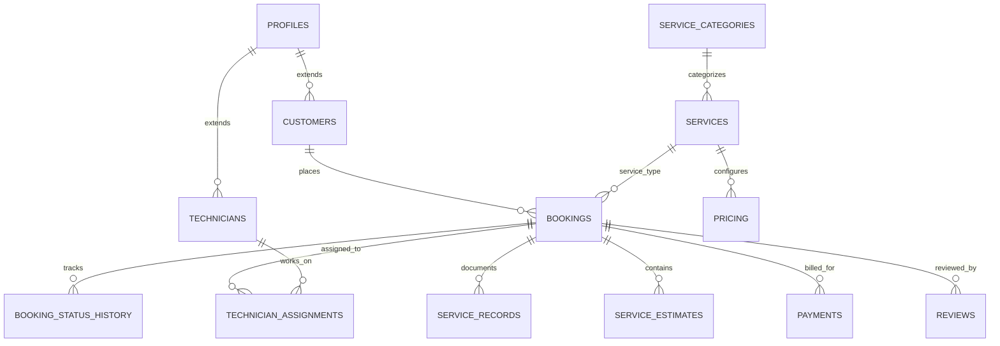

# COOLO.IN — Architectural Blueprint & System Design

**Brand:** COOLO (Air & Cooling Solutions)  
**Domain:** https://coolo.in  
**Initial Geography:** Bangalore, Karnataka, India  
**Platform Scope:** Customer Discovery → Multi-step Booking → Admin Operations → Technician Dispatch & Service Execution

---

## 1. System Overview & Technology Stack

| Layer | Technology | Rationale |
|---|---|---|
| **Frontend Framework** | Next.js 15 (App Router), React 19, TypeScript | Server Components, SEO optimization, high performance, clean API routes |
| **Styling & Design System** | Tailwind CSS v4 / PostCSS + Custom Design Tokens | Fast utility styling, mobile-first responsive layout, crisp cooling theme |
| **Icons & Visuals** | Lucide React + Curated SVG cooling icons | Featherweight, modern, customizable iconography |
| **Database & Auth** | Supabase (PostgreSQL 15+, Supabase Auth, Storage, RLS) | Relational integrity, Row Level Security, transactional consistency |
| **State & Validation** | Zod + React Hook Form | Strict client & server-side validation for phone numbers, dates, PINs |
| **Deployment Target** | Cloudflare Pages / Vercel / Edge Network | High-availability edge caching, sub-second TTFB, custom domain SSL |

---

## 2. Brand Identity & Visual Language

- **Core Colors:**
  - `Coolo Deep Slate` (`#0F172A` / `#0A192F`): Grounded, professional foundation representing trust and technical competence.
  - `Coolo Electric Cyan` (`#0284C7` / `#0EA5E9` / `#38BDF8`): Evokes active refrigeration, fresh circulating air, and modern tech.
  - `Coolo Arctic Mint` (`#0D9488` / `#14B8A6` / `#F0FDFA`): Clean air, purification, hygienic antibacterial deep cleaning.
  - `Coolo Pure Snow` (`#FFFFFF` / `#F8FAFC`): Crisp, airy whitespace that avoids visual clutter.
- **Typography:** Modern clean sans-serif with readable geometry (Inter / Outfit / System font stack).
- **Component Geometry:** Friendly rounded corners (`rounded-2xl`, `rounded-xl`), soft diffuse shadows, floating mobile action bars.
- **Mobile Action Bar:** Persistent bottom action dock (`Call Now`, `WhatsApp`, `Book Service`) on viewports under 768px.

---

## 3. Database Architecture (Supabase PostgreSQL)

### Key Tables
1. **`profiles`**: Linked 1:1 with `auth.users`. Holds `role` (`CUSTOMER`, `TECHNICIAN`, `ADMIN`, `SUPER_ADMIN`), name, mobile, avatar.
2. **`customers`**: Customer metadata, default address pointers, preferred notification channels.
3. **`technicians`**: Technician metadata, verification status, active dispatch status, rating aggregates.
4. **`service_areas`**: Bangalore areas (Indiranagar, Whitefield, HSR Layout, Koramangala, etc.) with PIN codes and serviceability flags.
5. **`service_categories` & `services`**: Catalog of cooling services (AC Repair, Service, Deep Cleaning, Installation, Gas Charging, AMC, Commercial).
6. **`pricing`**: Admin-configurable matrix by service and AC type (Split, Window, Cassette, Ducted, Other).
7. **`bookings`**: Central ledger with sequential human IDs (e.g. `COOLO-2026-000001`), customer info, address snapshot, scheduled date & slot, and lifecycle status.
8. **`booking_status_history`**: Audit trail of every status transition (`REQUESTED` → `CONFIRMED` → `ASSIGNED` → `TECHNICIAN_ON_THE_WAY` → `IN_PROGRESS` → `WAITING_FOR_APPROVAL` → `COMPLETED`).
9. **`technician_assignments`**: Job assignment dispatch with acceptance/rejection logging.
10. **`service_estimates` & `estimate_items`**: Extra work estimation mechanism for parts, labor, and refrigerant charging.
11. **`service_records`**: Before/after proof photos, diagnosis notes, and work completion log.
12. **`reviews`**: Post-service 1–5 star ratings, feedback, and moderation flags.
13. **`admin_notes`**: Internal operational notes with strict access control (never exposed to customers).

---

## 4. Security & Row Level Security (RLS) Rules

- **Customers**: Can read and write only their own profiles, addresses, bookings, and submitted reviews.
- **Technicians**: Can read only bookings and service records assigned to them; cannot browse global customer listings.
- **Admins & Super Admins**: Full operational CRUD across bookings, pricing, service areas, and technician assignments.
- **Public**: Can view active services, categories, published reviews, and active service areas; can invoke anonymous booking creation.

---

## 5. Phased Delivery Roadmap

- **Phase 1 (Current Step)**: Foundation, Project Scaffold, Design Tokens, Supabase Client & DDL Migrations, Homepage with Hero, Quick Booking Widget, Services Catalog, Trust Indicators, and Mobile Action Dock.
- **Phase 2**: Complete Marketing Site (All 8 Service Detail Pages, About, Service Areas Bangalore, Contact Form, Legal pages).
- **Phase 3**: Authentication & Role-based Routing (Customer Sign-in/Sign-up, Admin Guards, Technician Guards).
- **Phase 4**: Full 6-step Customer Booking Wizard with Live Booking Number generation.
- **Phase 5**: Admin Operations Portal (Dashboard KPIs, Booking Manager, Status Transitions, Technician Dispatch).
- **Phase 6**: Technician Portal (Job Acceptance, On-the-way, Diagnosis, Parts, Completion).
- **Phase 7 & 8**: Notifications Architecture (Email/SMS abstraction) and Customer Reviews moderation.
- **Phase 9**: Production Readiness, Cloudflare Deployment, SEO verification, and Analytics.
