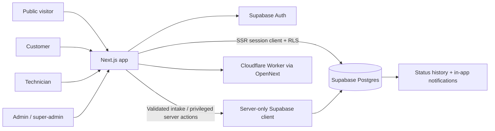

# COOLO Application Architecture

## Purpose

COOLO is a service-booking website and role-based operations portal for air-conditioning and cooling services. Public users browse the catalog, submit bookings, or contact support. Authenticated customers, technicians, admins, and super admins work through `/portal`.

This document describes the repository's implementation. A migration being present does not mean the website build containing related UI has been deployed to every environment.

## Stack and boundaries

- **Web:** Next.js 16 App Router, React 19, TypeScript, Tailwind CSS 4.
- **Hosting:** OpenNext adapter for Cloudflare Workers.
- **Identity/database:** Supabase Auth, Postgres, PostgREST, RLS policies, SQL functions and triggers.
- **Validation:** Zod for public booking/contact routes and server actions.
- **Browser client:** `src/lib/supabase/client.ts`; public URL and anon key only.
- **Server session client:** `src/lib/supabase/server.ts`; SSR cookies and public anon key, subject to RLS.
- **Privileged client:** `src/lib/supabase/admin.ts`; server-only `SUPABASE_SERVICE_ROLE_KEY`, which bypasses RLS.

The service-role key must never be imported into a client component, put in `wrangler.jsonc`, committed, or included in documentation.

## Route map

| Route | Responsibility | Access |
|---|---|---|
| `/` | Marketing home and quick-booking widget | Public |
| `/services`, `/services/[slug]` | Service catalog and detail pages | Public |
| `/areas`, `/areas/bangalore` | Service-area information | Public |
| `/book-service` | Detailed multi-step booking wizard | Public |
| `/contact` | Contact enquiry form | Public |
| `/api/bookings` | Validate and persist quick/detailed bookings | Public POST; server validated |
| `/api/contact` | Validate and persist enquiries | Public POST; server validated |
| `/portal/login` | Email/password auth, customer registration, Google OAuth | Public |
| `/auth/callback` | Exchange Auth callback code; allow only safe internal redirects | Public callback |
| `/portal` | Role-specific booking and operations workspace | Authenticated |
| `/about`, `/privacy`, `/terms`, `/robots.txt`, `/sitemap.xml` | Company, legal, and SEO pages | Public |

## Authentication and roles

New Auth users are provisioned by database triggers as `CUSTOMER`, with a linked `customers` row. Public signup metadata cannot select a staff role. Google OAuth is handled by Supabase Auth; the application never asks for a Google password.

Roles are stored in `public.profiles.role`:

- **CUSTOMER:** own linked bookings, eligible cancellation, estimate decision, service/payment records, completed-job review, and personal notifications.
- **TECHNICIAN:** active assignments, accept/decline, permitted job status steps, estimate submission, service report.
- **ADMIN:** booking queue, technician assignment, allowed status changes, contact enquiries, cash reconciliation.
- **SUPER_ADMIN:** admin features, staff invitation, and role management.

`getPortalAccount()` / `requirePortalAccount()` in `src/lib/auth/portal.ts` protect portal routes and actions. Actions check authorization again. RLS and database functions enforce the same boundaries below the UI.

Role updates use `public.update_user_role()`. It blocks self-demotion and demotion of the final super-admin. Profile-role triggers provision/reactivate or deactivate technician records and ensure a customer record when needed.

## Data model

The initial schema is in `supabase/migrations/20260925000001_initial_schema.sql`; later migrations extend it.

- `profiles`, `customers`, `technicians`: auth identity, role, customer profile, technician profile.
- `services`, `service_categories`, `service_areas`, `pricing`: catalog and operating areas. The current UI/API also use constants under `src/lib/constants/` for service/area validation.
- `bookings`: customer/contact data, requested service, schedule, AC details, address snapshot, status, and price values.
- `technician_assignments`: technician/booking association and assignment state.
- `service_estimates`, `estimate_items`: estimate totals/lines and customer decision.
- `service_records`: completed work report and final amount.
- `payments`: current portal records pending cash and administrator-confirmed cash collection.
- `reviews`: rating/comment for completed work.
- `booking_status_history`, `notifications`: audit trail and user-scoped in-app notifications.
- `contact_requests`: public enquiries restricted to staff reads.

Tables also exist for areas such as inventory, saved addresses, and parts. They do not currently have corresponding end-user portal workflows and should be treated as schema foundations, not finished features.

## Booking and work lifecycle

Booking statuses are `REQUESTED`, `CONFIRMED`, `ASSIGNED`, `TECHNICIAN_ON_THE_WAY`, `IN_PROGRESS`, `WAITING_FOR_APPROVAL`, `COMPLETED`, `CANCELLED`, and `NO_SHOW`.

1. Public booking intake validates the request, resolves the active service, optionally links the signed-in customer, and writes through the server-only client. Success is returned only after the database confirms the insert.
2. An administrator confirms or assigns a request. `assign_booking_technician()` performs assignment and booking-status updates transactionally.
3. An active technician accepts or declines. Accepted work progresses through `ASSIGNED → TECHNICIAN_ON_THE_WAY → IN_PROGRESS`.
4. For a customer-linked job, an in-progress technician can submit an estimate. The database writes estimate and items atomically and moves the booking to `WAITING_FOR_APPROVAL`.
5. The customer approves or rejects the pending estimate. Either decision returns the booking to `IN_PROGRESS` for follow-up.
6. An assigned technician submits a service report. A pending estimate blocks completion. Successful completion records the report, closes the assignment, marks the booking completed, and creates a pending cash payment record.
7. A customer can review completed work; an administrator can confirm cash collection.

Customers can cancel only `REQUESTED` or `CONFIRMED` bookings. Guest bookings (`customer_id IS NULL`) cannot use the portal estimate-approval flow and have no guest-claim/link workflow.

## Data access and security

- RLS is enabled by the initial migration; subsequent migrations add policies for each portal workflow.
- Customer queries are scoped through their `customers` row. Technician queries are scoped to an active profile and assignment. Contact requests are staff-only.
- Direct anonymous booking/contact table inserts are revoked. Public writes go through validated API routes.
- Technician assignment writes and multi-step role/workflow operations use guarded SQL functions. Direct out-of-order booking status updates are rejected by the database guard.
- Security-definer functions use a fixed `search_path`; the workflow migration also pins the existing role helper functions.
- Public intake routes currently have no application-level CAPTCHA or rate limit; configure Cloudflare/WAF controls before high-volume production use.

## Migration order

Apply all migration files in filename order:

1. `20260925000001_initial_schema.sql` — base schema, seed catalog/areas, initial RLS, booking number/history trigger.
2. `20260926000001_portal_roles_and_security.sql` — Auth profile/customer provisioning, role guard, portal policies and booking update guard.
3. `20260928000001_booking_security_and_assignment.sql` — remove public write paths, strengthen technician access, transactional assignment, customer re-provisioning.
4. `20260929000001_complete_role_workflows.sql` — role administration, assignment responses, estimates/approval, service completion, cash, reviews, notifications, history and state transitions.
5. `20260930000001_technician_role_provisioning.sql` — technician profile synchronization on trusted role changes.

For an existing database, verify its schema before baselining a migration; do not replay the initial schema blindly. Use `supabase migration list --linked`, preview with `supabase db push --dry-run`, and apply only after confirming the target project.

## Configuration and deployment

See [Developer Guide](DEVELOPER_GUIDE.md) for local development and Cloudflare deployment. Important constraints:

- Public `NEXT_PUBLIC_*` settings are embedded during build; rebuild after changing them.
- Keep `SUPABASE_SERVICE_ROLE_KEY` in local ignored environment configuration or as a Cloudflare Worker secret.
- Google OAuth requires the Google provider, Supabase callback URI, and application callback URLs configured in Supabase Auth.
- Invitations/confirmation/recovery mail depend on a configured SMTP provider and redirect allowlist.
- Deploying the database and deploying the web application are separate steps.
